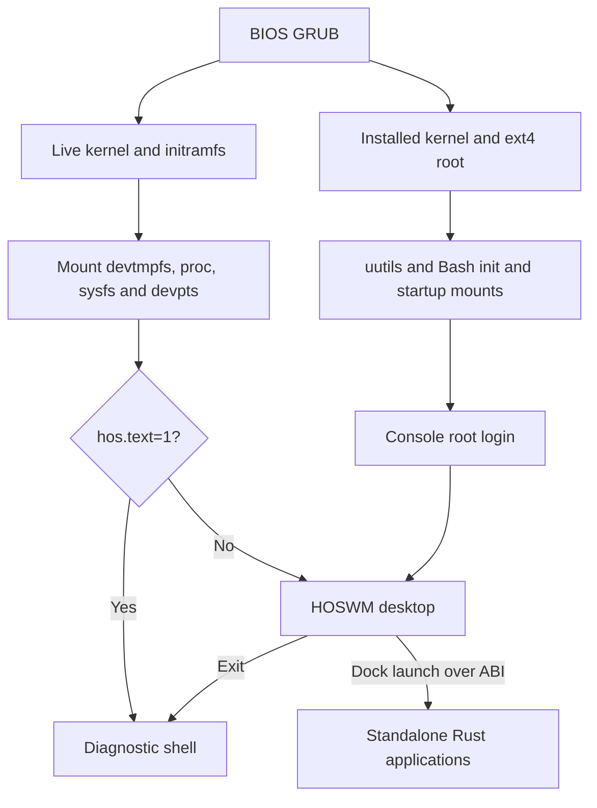

# hOS architecture

[Back to the project guide](../README.md)

hOS combines a configured Linux kernel and uutils and Bash userspace with a custom Rust window server. Linux provides processes, filesystems, devices and input; HOSWM owns desktop composition, window management and the application protocol. The terminal, installer and About UI run as separate Rust applications.

## Boot paths

`hos-init` is PID 1 in both paths. It starts the system services — network,
power, time and sound — supervises them with restart backoff, answers a
control socket and owns shutdown, and it supervises the desktop session in the
same way. The services and their protocol are described in
[init and system services](services.md); the graphical front end to all of
them is `hos-settings`.

The live image starts through `tooling/init`. Its initramfs contains the installer tools and a copy of the boot kernel at `/boot/vmlinuz`, all available from memory after startup. This lets the installer work when the ISO was booted from USB and no optical drive exposes it. The shell remains available after HOSWM exits or returns an error. The installer writes a separate startup script, `/etc/inittab` and `/etc/profile` for the installed system. Its installed GRUB entry loads the kernel directly from the ext4 root. The native wizard runs installation commands in a worker thread and reports progress to its HOSWM window.

## Desktop event loop

`input.rs` discovers `/dev/input/event*` devices, checks keyboard, relative-pointer and absolute-pointer capabilities, opens them nonblocking and grabs what it can. Missing input is not fatal: the session starts without a keyboard or mouse and picks devices up when they appear. An inotify watch on `/dev/input` wakes the loop on device changes, with a one second sweep as a fallback, and devices that disappear or fail are dropped and reported. Absolute pointers, including the QEMU tablet, are scaled to desktop coordinates in this module so the session handles one motion model. Arrivals, losses and evdev overflow become notifications; an overflow also clears held modifiers instead of ending the session.

`main.rs` opens the framebuffer, loads the configuration for the account that logged in, constructs the desktop and binds the application server. Dock clicks run the commands configured for each dock item.

Each loop drains a bounded amount of input, translates keys, services application requests and redraws when dirty. Client windows submit pixels and receive input through the local ABI. Pending screen captures are written from the frame that was actually presented.

`desktop.rs` stores windows in stacking order. It manages focus, dragging, edge resizing for windows that set the resizable flag, title-bar controls, dock items, the screen-top menu bar, notifications, GUI control focus, and bounded event queues. The menu bar reserves the top 24 rows: windows are clamped below it, and it shows the focused window's retained menus beside a built-in System menu. All application windows use the same socket ABI. Windows are limited to 24, with up to 128 controls and 128 queued events per window. When an event queue fills, its oldest event is discarded. HOSWM tracks the creating process and removes its windows when that process exits.

## Rendering and input

`Surface` owns a contiguous `Vec<u32>` of straight-alpha ARGB8888 pixels. It provides clipped pixels, rectangles, lines and image/surface composition with source-over blending. `Image` borrows pixel storage. Raster operations are separate from device presentation.

`Font` validates PSF1 font data, reads optional Unicode mappings, and draws fixed-width bitmap glyphs into a surface. The bundled font is 8×9 pixels. Missing glyphs fall back to the question-mark glyph; this is not a text shaping engine.

The active backend in `main.rs` is `framebuffer::Display`. It reads fbdev metadata, validates pixel layout, honors stride and visible offsets, converts pixels to packed true-color 16/24/32-bit output, and scales the logical 800×600 image with aspect-preserving black borders. Unsupported layouts include indexed color, planar data, rotation and direct-color LUT modes.

The backend switches the console to graphics mode and restores its previous mode when the display object is dropped. Forced process termination and release-mode aborts may bypass cleanup. `drm.rs` also contains a direct DRM backend, but the current executable does not select it; its ioctl declaration is reused for input.

`keyboard.rs` implements a US evdev map, independent left/right modifiers, Caps Lock, repeats, control bytes and terminal escape sequences. `shortcuts.rs` resolves key presses to actions through bindings that `config.rs` may replace, and `config.rs` parses `~/.hoswm/config.ini`, writing the annotated defaults when that file is missing. Unreadable settings become notifications rather than startup failures.

`toast.rs` owns the live notification stack and the append-only, checksummed `toastdb` log behind it. `menu.rs` holds the menu model, bar layout and drop-down drawing. `qoi.rs` encodes and decodes QOI images, used for dock icons and for screenshots of the screen or one window. The [configuration guide](configuration.md) documents all three file formats.

## Standalone applications

`src/bin/hos-terminal.rs` contains the terminal application and its PTY/ANSI screen model. It opens a Unix98 PTY, creates an interactive `/bin/sh` session with a controlling terminal, sets `TERM=ansi` and the `hos$ ` prompt, and communicates with HOSWM through the ABI. Window size changes update the PTY size. Closing the app triggers child cleanup.

The screen model implements a subset of ANSI behavior, including cursor movement, erase operations, colors and scrolling. It is a small terminal emulator, not a complete modern terminal implementation. `src/bin/hos-installer.rs` contains the installer UI and worker; it protects the session from exit while disk writes are active. `src/bin/hos-about.rs` is the About application, `src/bin/hos-notifications.rs` browses the notification log with its own menu bar menus, and `src/bin/hos-toast.rs` posts a notification from a shell. `src/bin/hos-notepad.rs` is a small raw-input text editor with file loading and Ctrl+S saving. `src/bin/hos-snake.rs` is a self-contained keyboard-driven Snake game. `src/bin/hos-files.rs` is a tabbed file browser: it copies and moves whole directories through the session clipboard, starts a terminal in the directory it is showing, and draws image previews. `src/bin/hos-image.rs` views QOI images with zoom, panning and a choice of scaling, and generates the previews the browser reads; both share the cache in `preview.rs`.

## Build and packaging

The build starts from a minimal kernel configuration and requires storage, graphics, console, input, PTY and filesystem features to be built in; loadable modules are disabled. uutils and Bash is also configured from a minimal baseline. HOSWM is compiled offline with static CRT linkage and checked for an ELF interpreter before packaging.

`mkrootfs.py` constructs a sorted `newc` archive directly, with explicit root ownership, guest modes, device nodes and symlinks. Gzip timestamps use `SOURCE_DATE_EPOCH`. It bundles HOSWM and its three Rust applications as static executables, host GRUB executables and modules, `mkfs.ext4`, and resolved shared libraries. These host-supplied components and compiler versions mean pinned downloads alone do not establish bit-for-bit reproducibility across different hosts.

## Source map

| Path | Responsibility |
| --- | --- |
| `HOSWM/src/main.rs` | Input discovery and desktop event loop |
| `HOSWM/src/desktop.rs` | Windows, dock, controls and composition |
| `HOSWM/src/surface.rs` | Software raster drawing and blending |
| `HOSWM/src/framebuffer.rs` | Active fbdev presentation and console mode |
| `HOSWM/src/drm.rs` | Alternate DRM backend and low-level ioctl declarations |
| `HOSWM/src/font.rs`, `default8x9.psf` | Font parsing and bundled glyphs |
| `HOSWM/src/keyboard.rs` | Key translation and modifier state |
| `HOSWM/src/input.rs` | Input device discovery, hotplug and absolute pointers |
| `HOSWM/src/config.rs`, `config.default.ini` | `~/.hoswm/config.ini` parsing and the written template |
| `HOSWM/src/shortcuts.rs` | Configurable action bindings and window cycling |
| `HOSWM/src/menu.rs` | Window menus, menu bar layout and drop-downs |
| `HOSWM/src/toast.rs` | Notification stack and the `toastdb` binary log |
| `HOSWM/src/qoi.rs` | QOI image decoding, encoding and screenshots |
| `HOSWM/src/preview.rs` | Cached image thumbnails shared by applications |
| `HOSWM/src/abi.rs` | Window server socket and request dispatch |
| `HOSWM/src/client.rs`, `include/hoswm.h`, `src/client.c` | Rust and C ABI clients |
| `HOSWM/src/bin/hos-terminal.rs` | Standalone terminal, PTY and ANSI screen model |
| `HOSWM/src/bin/hos-installer.rs` | Standalone installer UI and installation worker |
| `HOSWM/src/bin/hos-about.rs` | Standalone About application |
| `HOSWM/src/bin/hos-files.rs` | Tabbed file browser with previews and file operations |
| `HOSWM/src/bin/hos-image.rs` | Image viewer and preview generator |
| `HOSWM/src/bin/hos-notifications.rs` | Notification log browser |
| `HOSWM/src/bin/hos-toast.rs` | Command-line notification sender |
| `HOSWM/src/bin/hos-settings.rs` | Settings application for the services and the session |
| `HOSWM/src/bin/hos-notepad.rs` | Tiny text editor |
| `HOSWM/src/bin/hos-snake.rs` | Tiny Snake game |
| `HOSWM/src/audio.rs` | Application sound API: play a file, or write PCM |
| `HOSWM/src/init/mod.rs`, `config/` | Service paths, configuration parsing and written defaults |
| `HOSWM/src/init/ipc.rs` | The service protocol, its server loop and client |
| `HOSWM/src/init/supervisor.rs`, `unit.rs` | PID 1, restart policy and the control socket |
| `HOSWM/src/init/net.rs`, `dhcp.rs`, `wifi.rs` | `hos-netd`: links, DHCP, DNS and `wpa_supplicant` |
| `HOSWM/src/init/power.rs` | `hos-power`: batteries, buttons, suspend, inhibitors |
| `HOSWM/src/init/ntp.rs` | `hos-ntpd`: SNTP, parked while offline |
| `HOSWM/src/init/sound.rs`, `alsa.rs`, `pcm.rs`, `mixer.rs` | `hos-soundd`: mixer controls, playback and mixing |
| `HOSWM/src/init/bin/` | `hos-init`, the four services and `hosctl` |
| `HOSWM/examples/hello_gui.c` | Bundled GUI example |
| `HOSWM/tests/client_roundtrip.c` | C protocol integration fixture |
| `tooling/build.sh`, `env.sh`, `versions.env` | Build stages, environment and pins |
| `tooling/kernel.config`, `hos-password.c` | Kernel configuration and the password helper |
| `tooling/verify-prebuilt-kernel.py` | Kernel image/configuration checks |
| `tooling/mkrootfs.py`, `tests/test_mkrootfs.py` | Initramfs generation and metadata regression test |
| `tooling/init`, `grub.cfg` | Live startup and boot menu |
| `tooling/qemu.sh` | Development VM and disk commands |
